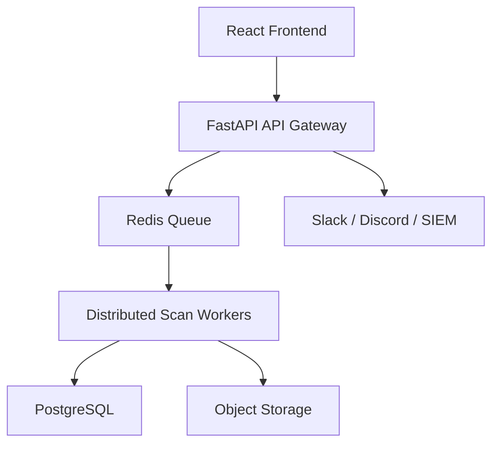

# AdaptiveScan Enterprise Platform Roadmap

This roadmap turns the scanner into a long-term enterprise security platform without mixing unsafe behavior into the scanner core.

## Build Principles

- Authorized targets only for external scanning.
- Passive discovery before active testing.
- Validation before reporting a finding as high confidence.
- Small, composable detector plugins instead of monolithic checks.
- Scan history, lifecycle, and compliance metadata are first-class data.

## Long-Term Architecture

## Build Order

1. Core Recon
2. Detector Coverage
3. Validation Engine
4. Authenticated Scanning
5. Continuous Monitoring
6. Vulnerability Lifecycle
7. Team Collaboration
8. Enterprise Dashboard
9. DevSecOps Integrations
10. Reporting and Compliance
11. Distributed Workers
12. AI-Assisted Prioritization

## Commercial Readiness Gates

- False positive rate is measurable.
- Findings have replay/validation evidence.
- External scans require authorization and scoped allowlists.
- Critical/high risk gates can fail CI.
- Findings map to CWE, OWASP, CVSS, and compliance frameworks.
- Scan history shows trends, regressions, and remediations.

## Implemented Enterprise Foundations

- Vulnerability lifecycle states: Open, Triaged, Assigned, Retesting, Resolved, Closed.
- Finding ownership, SLA target dates, analyst comments, and audit log events.
- SaaS tenancy primitives: organizations, workspaces, team members, RBAC role catalog, and scoped API keys.
- API key secrets are hashed at rest and only returned during creation.
- Capability and enterprise foundation APIs feed the Coverage dashboard.

## Current API Surface

- `GET /api/product/capabilities`
- `GET /api/product/enterprise-foundation`
- `GET /api/tenancy/overview`
- `POST /api/organizations`
- `POST /api/workspaces`
- `POST /api/api-keys`
- `GET /api/findings/{scan_id}/{finding_index}/lifecycle`
- `PUT /api/findings/{scan_id}/{finding_index}/lifecycle`
- `POST /api/findings/{scan_id}/{finding_index}/comments`
- `GET /api/audit-logs`
