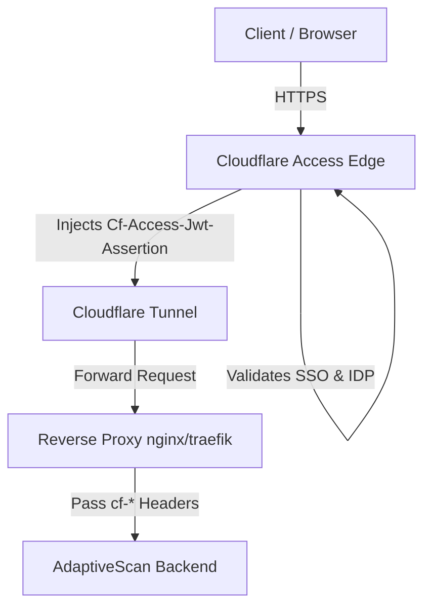

# Cloudflare Zero Trust & Reverse Proxy Deployment Guide

This document describes how to deploy AdaptiveScan behind a Cloudflare Tunnel/Access reverse proxy using Identity-Aware Authentication.

## Architecture Overview



## Cloudflare Access Integration

AdaptiveScan supports **Identity-Aware Authentication** via Cloudflare Access. When enabled:
1. Cloudflare Access intercepts incoming requests, authenticates the actor against the corporate IDP (SAML, OIDC, GSuite, Active Directory, etc.), and sets the `Cf-Access-Jwt-Assertion` header containing a signed JWT.
2. The AdaptiveScan backend extracts and verifies this JWT against Cloudflare's public keys (`https://<your-team>.cloudflareaccess.com/cdn-cgi/access/certs`) using RS256.
3. Upon validation, the user's email is mapped to an internal database record to establish their RBAC Principal.

### Environment Configuration

Configure the following environment variables on the backend:
```env
CLOUDFLARE_ACCESS_ENABLED=true
CLOUDFLARE_ACCESS_AUD=your-cloudflare-access-audience-tag
CLOUDFLARE_ACCESS_TEAM=your-cloudflare-team-subdomain
```

## Reverse Proxy Header Hardening (nginx.conf)

Ensure your reverse proxy validates and sanitizes incoming headers before forwarding requests to the Python application. Below is a secure-by-default NGINX configuration block:

```nginx
# nginx.conf configuration for AdaptiveScan Zero Trust
server {
    listen 443 ssl http2;
    server_name dashboard.adaptivescan.com;

    ssl_certificate /etc/ssl/certs/dashboard.crt;
    ssl_certificate_key /etc/ssl/private/dashboard.key;

    # Secure TLS Defaults
    ssl_protocols TLSv1.2 TLSv1.3;
    ssl_ciphers ECDHE-ECDSA-AES128-GCM-SHA256:ECDHE-RSA-AES128-GCM-SHA256:ECDHE-ECDSA-AES256-GCM-SHA256:ECDHE-RSA-AES256-GCM-SHA256;
    ssl_prefer_server_ciphers off;

    # HSTS Policy (1 Year)
    add_header Strict-Transport-Security "max-age=31536000; includeSubDomains; preload" always;

    # Reverse Proxy Configuration
    location / {
        proxy_pass http://127.0.0.1:8000;
        proxy_http_version 1.1;

        # Standard Forwarding Headers
        proxy_set_header Host $host;
        proxy_set_header X-Real-IP $remote_addr;
        proxy_set_header X-Forwarded-For $proxy_add_x_forwarded_for;
        proxy_set_header X-Forwarded-Proto $scheme;

        # WebSocket Support
        proxy_set_header Upgrade $http_upgrade;
        proxy_set_header Connection "upgrade";

        # Zero Trust Assertion Headers
        proxy_set_header Cf-Access-Jwt-Assertion $http_cf_access_jwt_assertion;

        # Security Headers
        proxy_hide_header X-Powered-By;
        add_header X-Frame-Options "DENY" always;
        add_header X-Content-Type-Options "nosniff" always;
        add_header X-XSS-Protection "1; mode=block" always;
        add_header Content-Security-Policy "default-src 'self'; script-src 'self'; style-src 'self' 'unsafe-inline'; img-src 'self' data:; frame-ancestors 'none';" always;
    }
}
```

## IP White-listing and Tunnel Enforcement

To prevent attackers from bypassing Cloudflare Access and hitting your reverse proxy directly:
1. If using **Cloudflare Tunnel (`cloudflared`)**, bind your backend reverse proxy to `127.0.0.1` only. Do not expose public ports on your hosts.
2. If using standard routing, configure firewall rules (IP tables or cloud security groups) to strictly accept traffic originating from [Cloudflare IP Ranges](https://www.cloudflare.com/ips/).
